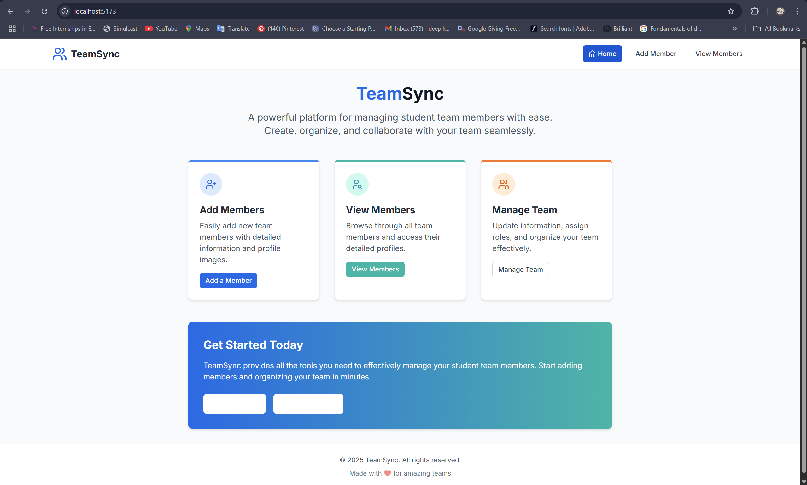
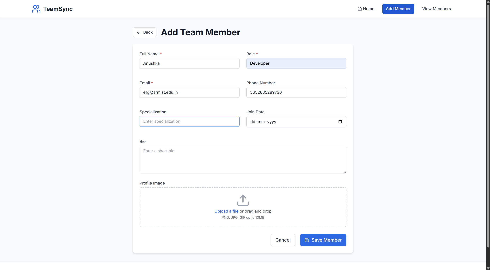
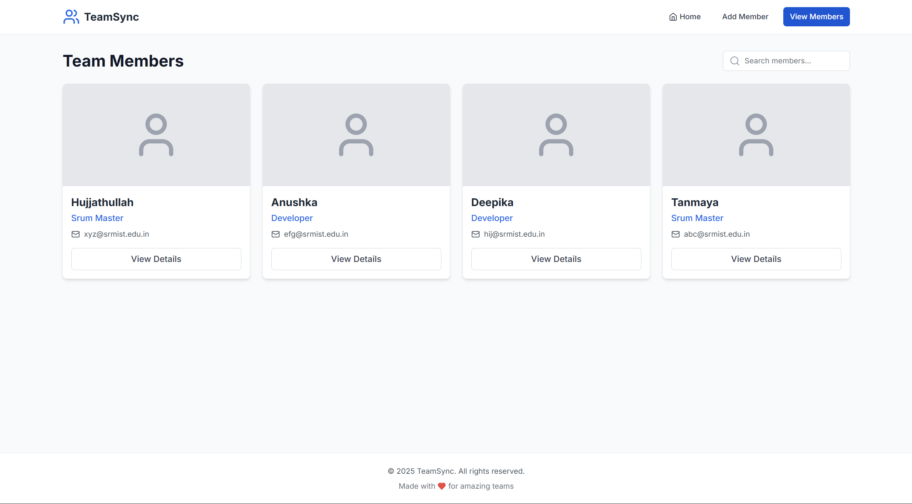

# 🧑‍💻 TeamSync – Student Team Members Management Application

---

## 📘 Project Description

TeamSync is a full-stack web application for managing student team members. It allows users to add, view, and manage detailed member profiles including name, role, email, and a profile image. Built using **React (Vite + TypeScript)** and **Node.js + Express + MongoDB**, the app provides clean navigation and responsive features for effective team collaboration.
Site Deployed at : https://studentteammanager.netlify.app/

---

## ⚙️ Installation Steps

### 🔧 Prerequisites
- Node.js and npm installed
- MongoDB running locally (or Atlas)
- Git

---

### 📁 Backend Setup

1. Navigate to the backend directory:
```bash
cd backend
```

2. Install dependencies:
```bash
npm install
```

> This installs:
> - `express` – server framework  
> - `mongoose` – MongoDB connection  
> - `multer` – image upload  
> - `cors` – cross-origin requests  
> - `dotenv` – environment variables  
> - `nodemon` – auto-restarts for development

3. Create a `.env` file inside `backend/`:
```env
PORT=5000
MONGODB_URI=mongodb://localhost:27017/student-team-management
```

4. Start the backend server:
```bash
nodemon server.js
```

---

### 💻 Frontend Setup

1. Navigate to the root directory:
```bash
cd ..
```

2. Install frontend dependencies:
```bash
npm install
```

3. Run the frontend development server:
```bash
npm run dev
```

4. Open the app in browser:  
[http://localhost:5173](http://localhost:5173)

---

## 🔗 API Endpoints

| Method | Endpoint             | Description                            |
|--------|----------------------|----------------------------------------|
| POST   | `/api/members`       | Add a new team member (with image)     |
| GET    | `/api/members`       | Get all team members                   |
| GET    | `/api/members/:id`   | Get full details of a specific member  |

Uploaded images are served from:
```
http://localhost:5000/uploads/{filename}
```

---

## 🚀 How to Run the App

1. **Start MongoDB** (locally or on Atlas).
2. **Start backend**:
   ```bash
   cd backend
   npm run dev
   ```
3. **Start frontend**:
   ```bash
   cd ..
   npm run dev
   ```
4. **Use the app**:
   - Add members
   - View all members
   - View member details

---

## 📸 Screenshots

### 🏠 Home Page


### 📝 Add Member Form


### 👤 Member Detail Page


---

